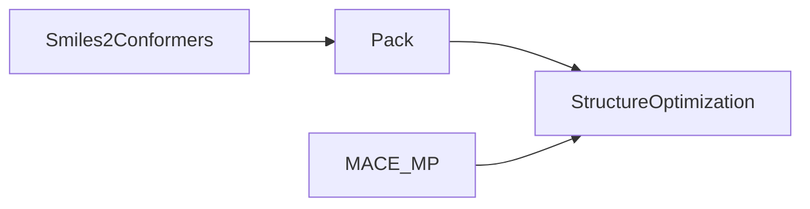

[](https://coveralls.io/github/zincware/ZnTrack)
[](https://codecov.io/gh/zincware/ZnTrack)
[](https://codeclimate.com/github/zincware/ZnTrack/maintainability)

[](https://badge.fury.io/py/zntrack)
[](https://github.com/psf/black/)
[](https://zntrack.readthedocs.io/en/latest/?badge=latest)
[](https://mybinder.org/v2/gh/zincware/ZnTrack/HEAD)
[](https://arxiv.org/abs/2401.10603)
[](https://zntrack.readthedocs.io/en/latest/)
[](https://github.com/zincware)
[](https://discord.gg/7ncfwhsnm4)


# ZnTrack: Make Your Python Code Reproducible!

ZnTrack (`zɪŋk træk`) is a lightweight and easy-to-use Python package for
converting your existing Python code into reproducible workflows. By structuring
your code as a directed graph with well-defined inputs and outputs, ZnTrack
ensures reproducibility, scalability, and ease of collaboration.

## Key Features

- **Reproducible Workflows**: Convert Python scripts into reproducible workflows
  with minimal effort.
- **Parameter, Output, and Metric Tracking**: Easily track parameters, outputs,
  and metrics in your Python code.
- **Lightweight and Database-Free**: ZnTrack is lightweight and does not require
  any databases.
- **DVC Integration**: Seamlessly integrates with [DVC](https://dvc.org) for
  data version control.

## Example: Molecular Dynamics Workflow

Let’s take a workflow that constructs a periodic, atomistic system of Ethanol
and runs a geometry optimization using MACE-MP-0.

### Original Workflow

```python
from ase.optimize import LBFGS
from mace.calculators import mace_mp
from rdkit2ase import pack, smiles2conformers

model = mace_mp()

frames = smiles2conformers(smiles="CCO", numConfs=32)
box = pack(data=[frames], counts=[32], density=789)

box.calc = model

dyn = LBFGS(box, trajectory="optim.traj")
dyn.run(fmax=0.5)
```

<details>
<summary>Dependencies</summary>
For this example to work, you will need:
- [MACE](https://github.com/ACEsuit/mace)
- [Packmol](https://github.com/m3g/packmol)
- [rdkit2ase](https://github.com/zincware/rdkit2ase)
</details>

### Converted Workflow with ZnTrack

To make this workflow reproducible, we convert it into a graph structure:



#### Node Definitions

```python
import zntrack
import ase.io
from pathlib import Path

class Smiles2Conformers(zntrack.Node):
    smiles: str = zntrack.params()
    numConfs: int = zntrack.params(32)

    frames_path: Path = zntrack.outs_path(zntrack.nwd / "frames.xyz")

    def run(self) -> None:
        frames = smiles2conformers(smiles=self.smiles, numConfs=self.numConfs)
        ase.io.write(frames, self.frames_path)

    @property
    def frames(self) -> list[ase.Atoms]:
        with self.state.fs.open(self.frames_path, "r") as f:
            return list(ase.io.iread(f, ":", format="extxyz"))


class Pack(zntrack.Node):
    data: list[list[ase.Atoms]] = zntrack.deps()
    counts: list[int] = zntrack.params()
    density: float = zntrack.params()

    frames_path: Path = zntrack.outs_path(zntrack.nwd / "frames.xyz")

    def run(self) -> None:
        box = pack(data=self.data, counts=self.counts, density=self.density)
        ase.io.write(box, self.frames_path)

    @property
    def frames(self) -> list[ase.Atoms]:
        with self.state.fs.open(self.frames_path, "r") as f:
            return list(ase.io.iread(f, ":", format="extxyz"))


@dataclass
class MACE_MP:
    model: str = "medium"

    def get_calculator(self, **kwargs):
        return mace_mp(model=self.model)


class StructureOptimization(zntrack.Node):
    model: MACE_MP = zntrack.deps()
    data: list[ase.Atoms] = zntrack.deps()
    data_id: int = zntrack.params()
    fmax: float = zntrack.params(0.05)

    frames_path: Path = zntrack.outs_path(zntrack.nwd / "frames.traj")

    def run(self):
        atoms = self.data[self.data_id]
        atoms.calc = self.model.get_calculator()
        dyn = LBFGS(atoms, trajectory=self.frames_path)
        dyn.run(fmax=0.5)

    @property
    def frames(self) -> list[ase.Atoms]:
        with self.state.fs.open(self.frames_path, "rb") as f:
            return list(ase.io.iread(f, ":", format="traj"))
```

#### Building and Running the Workflow

```python
import zntrack
from src import MACE_MP, Smiles2Conformers, Pack, StructureOptimization

project = zntrack.Project()

model = MACE_MP()

with project:
    etoh = Smiles2Conformers(smiles="CCO", numConfs=32)
    box = Pack(data=[etoh.frames], counts=[32], density=789)
    optm = StructureOptimization(model=model, data=box.frames, data_id=-1, fmax=0.5)

project.repro()
```

#### Accessing Results

```python
import zntrack

optm = zntrack.from_rev(name="StructureOptimization")
print(optm.frames)
```

For more examples, check out the following packages that build on top of
ZnTrack:

- [MLIPx](https://mlipx.readthedocs.io/en/latest/)
- [IPSuite](https://github.com/zincware/IPSuite)

______________________________________________________________________

## Technical Details

### ZnTrack as an Object-Relational Mapping for DVC

ZnTrack provides an easy-to-use interface for DVC directly from Python. It
handles all the computational overhead of reading config files, defining outputs
in the `dvc.yaml`, and much more.

For more information on DVC, visit their [homepage](https://dvc.org/doc).

______________________________________________________________________

## References

If you use ZnTrack in your research, please cite us:

```bibtex
@misc{zillsZnTrackDataCode2024,
  title = {{{ZnTrack}} -- {{Data}} as {{Code}}},
  author = {Zills, Fabian and Sch{\"a}fer, Moritz and Tovey, Samuel and K{\"a}stner, Johannes and Holm, Christian},
  year = {2024},
  eprint={2401.10603},
  archivePrefix={arXiv},
}
```

______________________________________________________________________

## Copyright

This project is distributed under the
[Apache License Version 2.0](https://github.com/zincware/ZnTrack/blob/main/LICENSE).

______________________________________________________________________

## Similar Tools

Here’s a list of other projects that either work together with ZnTrack or
achieve similar results with slightly different goals or programming languages:

- [DVC](https://dvc.org/) - Main dependency of ZnTrack for Data Version Control.
- [dvthis](https://github.com/jcpsantiago/dvthis) - Introduce DVC to R.
- [DAGsHub Client](https://github.com/DAGsHub/client) - Logging parameters from
  within Python.
- [MLFlow](https://mlflow.org/) - A Machine Learning Lifecycle Platform.
- [Metaflow](https://metaflow.org/) - A framework for real-life data science.
- [Hydra](https://hydra.cc/) - A framework for elegantly configuring complex
  applications.
- [Snakemake](https://snakemake.readthedocs.io/en/stable/) - Workflow management
  system for reproducible and scalable data analyses.
