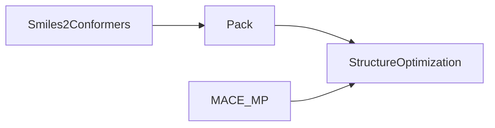

[](https://codecov.io/gh/zincware/ZnTrack)

[](https://badge.fury.io/py/zntrack)
[](https://github.com/psf/black/)
[](https://zntrack.readthedocs.io/en/latest/?badge=latest)
[](https://mybinder.org/v2/gh/zincware/ZnTrack/HEAD)
[](https://arxiv.org/abs/2401.10603)
[](https://zntrack.readthedocs.io/en/latest/)
[](https://github.com/zincware)
[](https://discord.gg/7ncfwhsnm4)


# ZnTrack: Make Your Python Code Reproducible!

ZnTrack (`zɪŋk træk`) is a lightweight and easy-to-use Python package for
converting your existing Python code into reproducible workflows. By structuring
your code as a directed graph with well-defined inputs and outputs, ZnTrack
ensures reproducibility, scalability, and ease of collaboration.

## Key Features

- **Reproducible Workflows**: Convert Python scripts into reproducible workflows with minimal effort.
- **Parameter, Output, and Metric Tracking**: Easily track parameters, outputs, and metrics in your Python code.
- **Shareable and Collaborative**: Collaborate with your team by working together through GIT. Share your workflows and use parts in other projects or package them as Python packages.
- **DVC Integration**: ZnTrack is built on top of [DVC](https://dvc.org) for version control and experiment management and seamlessly integrates into the [DVC](https://dvc.org) ecosystem.


## Example: Molecular Dynamics Workflow

Let’s take a workflow that constructs a periodic, atomistic system of Ethanol
and runs a geometry optimization using
[MACE-MP-0](https://arxiv.org/abs/2401.00096).

### Original Workflow

```python
from ase.optimize import LBFGS
from mace.calculators import mace_mp
from rdkit2ase import pack, smiles2conformers

model = mace_mp()

frames = smiles2conformers(smiles="CCO", numConfs=32)
box = pack(data=[frames], counts=[32], density=789)

box.calc = model

dyn = LBFGS(box, trajectory="optim.traj")
dyn.run(fmax=0.5)
```

<details>
<summary>Dependencies</summary>
For this example to work, you will need:
<ul>
  <li>https://github.com/ACEsuit/mace</li>
  <li>https://github.com/m3g/packmol</li>
  <li>https://github.com/zincware/rdkit2ase</li>
</ul>
</details>

### Converted Workflow with ZnTrack

To make this workflow reproducible, we convert it into a **directed graph
structure** where each step is represented as a **Node**. Nodes define their
inputs, outputs, and the computational logic to execute. Here's the graph
structure for our example:



#### Node Definitions

In ZnTrack, each **Node** is defined as a Python class. The class attributes
define the **inputs** (parameters and dependencies) and **outputs**, while the
`run` method contains the computational logic to be executed.

> [!NOTE]
> ZnTrack uses Python dataclasses under the hood, providing an automatic
> `__init__` method. Starting from Python 3.11, most IDEs should reliably
> provide type hints for ZnTrack Nodes.

> [!TIP]
> For files produced during the `run` method, ZnTrack provides a unique
> **Node Working Directory** (`zntrack.nwd`). Always use this directory to store
> files to ensure reproducibility and avoid conflicts.

```python
from dataclasses import dataclass
from pathlib import Path

import ase.io
from ase.optimize import LBFGS
from mace.calculators import mace_mp
from rdkit2ase import pack, smiles2conformers

import zntrack


class Smiles2Conformers(zntrack.Node):
    smiles: str = zntrack.params()  # A required parameter
    numConfs: int = zntrack.params(32)  # A parameter with a default value

    frames_path: Path = zntrack.outs_path(zntrack.nwd / "frames.xyz")  # Output file path

    def run(self) -> None:
        frames = smiles2conformers(smiles=self.smiles, numConfs=self.numConfs)
        ase.io.write(self.frames_path, frames)

    @property
    def frames(self) -> list[ase.Atoms]:
        # Load the frames from the output file using the node's filesystem
        with self.state.fs.open(self.frames_path, "r") as f:
            return list(ase.io.iread(f, ":", format="extxyz"))


class Pack(zntrack.Node):
    data: list[list[ase.Atoms]] = zntrack.deps()  # Input dependency (list of ASE Atoms)
    counts: list[int] = zntrack.params()  # Parameter (list of counts)
    density: float = zntrack.params()  # Parameter (density value)

    frames_path: Path = zntrack.outs_path(zntrack.nwd / "frames.xyz")  # Output file path

    def run(self) -> None:
        box = pack(data=self.data, counts=self.counts, density=self.density)
        ase.io.write(self.frames_path, box)

    @property
    def frames(self) -> list[ase.Atoms]:
        # Load the packed structure from the output file
        with self.state.fs.open(self.frames_path, "r") as f:
            return list(ase.io.iread(f, ":", format="extxyz"))


# We could hardcode the MACE_MP model into the StructureOptimization Node, but we
# can also define it as a dependency. Since the model doesn't require a `run` method,
# we define it as a `@dataclass`.


@dataclass
class MACE_MP:
    model: str = "medium"  # Default model type

    def get_calculator(self, **kwargs):
        return mace_mp(model=self.model)


class StructureOptimization(zntrack.Node):
    model: MACE_MP = zntrack.deps()  # Dependency (MACE_MP model)
    data: list[ase.Atoms] = zntrack.deps()  # Dependency (list of ASE Atoms)
    data_id: int = zntrack.params()  # Parameter (index of the structure to optimize)
    fmax: float = zntrack.params(0.05)  # Parameter (force convergence threshold)

    frames_path: Path = zntrack.outs_path(zntrack.nwd / "frames.traj")  # Output file path

    def run(self):
        atoms = self.data[self.data_id]
        atoms.calc = self.model.get_calculator()
        dyn = LBFGS(atoms, trajectory=self.frames_path.as_posix())
        dyn.run(fmax=0.5)

    @property
    def frames(self) -> list[ase.Atoms]:
        # Load the optimization trajectory from the output file
        with self.state.fs.open(self.frames_path, "rb") as f:
            return list(ase.io.iread(f, ":", format="traj"))
```

#### Building and Running the Workflow

Now that we’ve defined all the necessary Nodes, we can build and execute the
workflow. Follow these steps:

1. **Initialize a new directory** for your project:

   ```bash
   git init
   dvc init
   ```

1. **Create a Python module** for the Node definitions:

   - Create a file `src/__init__.py` and place the Node definitions inside it.

1. **Define and execute the workflow** in a `main.py` file:

   ```python
    from src import MACE_MP, Pack, Smiles2Conformers, StructureOptimization

    import zntrack

    # Initialize the ZnTrack project
    project = zntrack.Project()

    # Define the MACE-MP model
    model = MACE_MP()

    # Build the workflow graph
    with project:
        etoh = Smiles2Conformers(smiles="CCO", numConfs=32)
        box = Pack(data=[etoh.frames], counts=[32], density=789)
        optm = StructureOptimization(model=model, data=box.frames, data_id=-1, fmax=0.5)

    # Execute the workflow
    project.repro()
   ```

> [!TIP]
> If you don’t want to execute the graph immediately, use
> `project.build()` instead. You can run the graph later using `dvc repro` or
> the [paraffin](https://github.com/zincware/paraffin) package.

#### Accessing Results

Once the workflow has been executed, the results are stored in the respective
files. For example, the optimized trajectory is saved in
`nodes/StructureOptimization/frames.traj`.

You can load the results directly using ZnTrack, without worrying about file
paths or formats:

```python
import zntrack

# Load the StructureOptimization Node
optm = zntrack.from_rev(name="StructureOptimization")
# you can pass `remote: str` and `rev: str` to access data from
# a different commit or a remote repository.

# Access the optimization trajectory
print(optm.frames)
```

______________________________________________________________________

### More Examples

For additional examples and advanced use cases, check out these packages built
on top of ZnTrack:

- [mlipx](https://mlipx.readthedocs.io/en/latest/) - Machine Learned Interatomic Potential eXploration.
- [IPSuite](https://github.com/zincware/IPSuite) - Machine Learned **I**nteratomic **P**otential Tools.

______________________________________________________________________

## References

If you use ZnTrack in your research, please cite us:

```bibtex
@misc{zillsZnTrackDataCode2024,
  title = {{{ZnTrack}} -- {{Data}} as {{Code}}},
  author = {Zills, Fabian and Sch{\"a}fer, Moritz and Tovey, Samuel and K{\"a}stner, Johannes and Holm, Christian},
  year = {2024},
  eprint={2401.10603},
  archivePrefix={arXiv},
}
```

______________________________________________________________________

## Copyright

This project is distributed under the
[Apache License Version 2.0](https://github.com/zincware/ZnTrack/blob/main/LICENSE).

______________________________________________________________________

## Similar Tools

Here’s a list of other projects that either work together with ZnTrack or
achieve similar results with slightly different goals or programming languages:

- [DVC](https://dvc.org/) - Main dependency of ZnTrack for Data Version Control.
- [dvthis](https://github.com/jcpsantiago/dvthis) - Introduce DVC to R.
- [DAGsHub Client](https://github.com/DAGsHub/client) - Logging parameters from
  within Python.
- [MLFlow](https://mlflow.org/) - A Machine Learning Lifecycle Platform.
- [Metaflow](https://metaflow.org/) - A framework for real-life data science.
- [Hydra](https://hydra.cc/) - A framework for elegantly configuring complex
  applications.
- [Snakemake](https://snakemake.readthedocs.io/en/stable/) - Workflow management
  system for reproducible and scalable data analyses.
