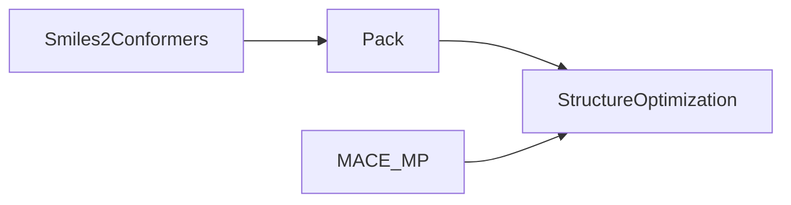

[](https://coveralls.io/github/zincware/ZnTrack)
[](https://codecov.io/gh/zincware/ZnTrack)
[](https://codeclimate.com/github/zincware/ZnTrack/maintainability)

[](https://badge.fury.io/py/zntrack)
[](https://github.com/psf/black/)
[](https://zntrack.readthedocs.io/en/latest/?badge=latest)
[](https://mybinder.org/v2/gh/zincware/ZnTrack/HEAD)
[](https://arxiv.org/abs/2401.10603)
[](https://zntrack.readthedocs.io/en/latest/)
[](https://github.com/zincware)
[](https://discord.gg/7ncfwhsnm4)


# ZnTrack: Make your Python Code reproducible!

ZnTrack enables you to convert your existing Python code into reproducible workflows by converting them into directed graph structure with well defined inputs and outputs per node.

## Example

Let us take the following workflow that constructs a periodic, atomistic system of Ethanol and runs a geometry optimization using MACE-MP-0.

```python
from ase.optimize import LBFGS
from mace.calculators import mace_mp
from rdkit2ase import pack, smiles2conformers

model = mace_mp()

frames = smiles2conformers(smiles="CCO", numConfs=32)
box = pack(data=[frames], counts=[32], density=789)

box.calc = model

dyn = LBFGS(box, trajectory="optim.traj")
dyn.run(fmax=0.5)
```

<details>
<summary>Dependencencyes</summary>
For this example to work you will need
- https://github.com/ACEsuit/mace
- https://github.com/m3g/packmol
- https://github.com/zincware/rdkit2ase
</details>

To make this reproducible, we convert it into the following graph structure:



```python
import zntrack
import ase.io
from pathlib import Path

class Smiles2Conformers(zntrack.Node):
  smiles: str = zntrack.params()
  numConfs: int = zntrack.params(32)

  frames_path: Path = zntrack.outs_path(zntrack.nwd / "frames.xyz")

  def run(self) -> None:
    frames = smiles2conformers(smiles=self.smiles, numConfs=self.numConfs)
    ase.io.write(frames, self.frames_path)

  @property
  def frames(self) -> list[ase.Atoms]:
    with self.state.fs.open(self.frames_path, "r") as f:
      return list(ase.io.iread(f, ":", format="extxyz"))


class Pack(zntrack.Node):
  data: list[list[ase.Atoms]] = zntrack.deps()
  counts: list[int] = zntrack.params()
  density: float = zntrack.params()

  frames_path: Path = zntrack.outs_path(zntrack.nwd / "frames.xyz")

  def run(self) -> None:
    box = pack(data=self.data, counts=self.counts, density=self.density)
    ase.io.write(box, self.frames_path)

  @property
  def frames(self) -> list[ase.Atoms]:
    with self.state.fs.open(self.frames_path, "r") as f:
      return list(ase.io.iread(f, ":", format="extxyz"))

```

We could hardcode the MACE_MP model into the StructureOptimization Node, but we can also define it as a dependency.
In contrast to `Smiles2Conformers` and `Pack` the model does not require a `run` method and thus we can define it as a `@dataclass`

```python
from dataclasses import dataclass

@dataclass
class MACE_MP:
  model: str = "medium"

  def get_calculator(self, **kwargs):
    return mace_mp(model=self.model)


class StructureOptimization(zntrack.Node):
  model: MACE_MP = zntrack.deps()
  data: list[ase.Atoms] = zntrack.deps()
  data_id: int = zntrack.params()
  fmax: float = zntrack.params(0.05)

  frames_path: Path = zntrack.outs_path(zntrack.nwd / "frames.traj")

  def run(self):
    atoms = self.data[self.data_id]
    atoms.calc = self.model.get_calculator()
    dyn = LBFGS(atoms, trajectory=self.frames_path)
    dyn.run(fmax=0.5)

  @property
  def frames(self) -> list[ase.Atoms]:
    with self.state.fs.open(self.frames_path, "rb") as f:
      return list(ase.io.iread(f, ":", format="traj"))
```

Now that we have defined all necessary Nodes we can put them to use and build our graph:

```python
project = zntrack.Project()

model = MACE_MP()

with project:
  etoh = Smiles2Conformers(
    smiles="CCO",
    numConfs=32
  )
  box = Pack(
    data=[etoh.frames],
    counts=[32],
    density=789
  )
  optm = StructureOptimization(
    model=model,
    data=box.frames,
    data_id=-1,
    fmax=0.5
  )

project.repro()
```
