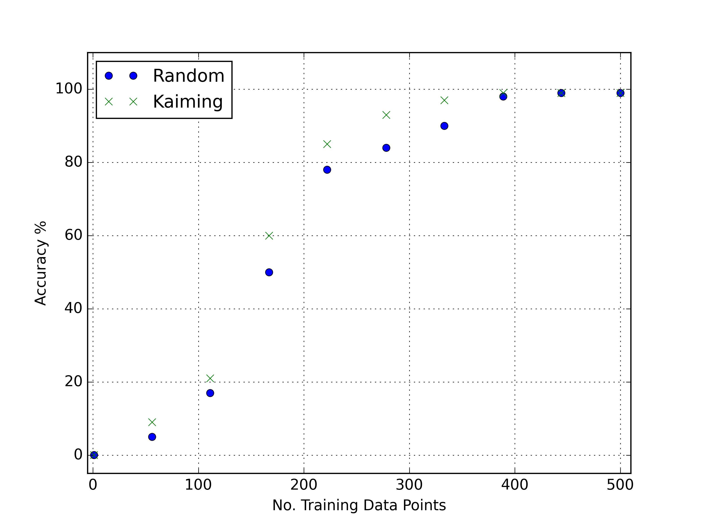

Directed Acyclic Graphs (DAGs)
------------------------------

The fundamental goal of ZnTrack is to put your workflow onto a graph thereby taking
advantage of the mathematical and computational properties of these structures. As
graphs, specifically directed acyclic graphs, are such a fundamental component of this
package, we have included here a theoretical background section as a helpful
reference.

Graphs
======
When we talk about graphs here we are not discussing the x-y grid paper diagrams from
your favourite high school classes, rather we are talking about the mathematical
structures underpinning many modern theories.
Graphs in general are defined as sets of vertices connected to each other by edges.
A typical example of a graph is shown below:

.. image:: ../img/graph.png
   :width: 400
   :alt: Image of a standard undirected graph.

In this figure we can see 5 vertices (nodes) each connected to two others by a straight
line with no particular direction. Mathematically, one would write this as follows:

.. math::

   \text{Let } G &= (V, E) \text{ be a graph with vertex set V and edge set E.} \\
   V &= \{ 1, 2, 3, 4, 5 \}, \text{ and} \\
   E &= \{ \{1, 2\}, \{2, 3\}, \{3, 4\}, \{4, 5\}, \{5, 1\} \}

Note that the edge set :math:`E` is a set consisting of smaller sets denoted by their
curly braces :math:`\{ \}`. An important property of a set is that it cannot contain repeated
elements and that the elements are permutation invariant. This means that the set
:math:`\{5, 1\}` is equal to the set :math:`\{1, 5\}`. The consequence graphically is
that the graph we have described with :math:`G` is undirected. This can be understood
by thinking that when I write :math:`\{1, 2\}` that node 1 is connected to node 2 AND
vice versa, e.g. node 2 is also connected to node 1.

Directed Graphs (Digraph)
^^^^^^^^^^^^^^^^^^^^^^^^^

In a case where we need to have information about the direction of the connections
within a graph, it becomes necessary to adapt the way we write them.
Graphically a directed graph is constructed by simple identifying directions between
vertices as outlined below:

.. image:: ../img/digraph.png
   :width: 400
   :alt: Image of a standard undirected graph.

In this case you can see that node 1 is connected to node 2 but not vice versa. Due to
the limitations on set definitions (namely no repeats allowed and permutation invariance)
, we need to adapt how we write this down mathematically.

.. math::

   \text{Let } G &= (V, E) \text{ be a graph with vertex set V and edge set E.} \\
   V &= \{ 1, 2, 3, 4, 5 \}, \text{ and} \\
   E &= \{ (1, 2), (2, 3), (3, 4), (4, 5), (5, 4), (5, 1) \}

Did you spot what changed? Yes, we exchanged the curly brackets :math:`\{\}` with a simple
parenthesis :math:`()` and that has made all the difference. In this case the Edge set
has become a set of directed edges rather than a set of sets. In this case each element
of :math:`E` is not a set but a distinct object and therefore can be repeated.
Furthermore, elements within the directed edges are NOT permutation invariant,
e.g. :math:`(1, 5) \neq (5, 1)`. With this, we can create a directed graph or digraph
as it is commonly referred.

Acyclic Graphs
^^^^^^^^^^^^^^
The final thing that we need to discuss in our limited introduction to graph theory is
the idea of an acyclic graph.

Consider the figure below:

.. image:: ../img/cyclic.png
   :width: 400
   :alt: Image of a standard undirected graph.

and its mathematical description:

.. math::

   \text{Let G } &= (V, E) \text{ be a graph with vertex set V and edge set E.} \\
   V &= \{ 1, 2, 3, 4, 5 \}, \text{ and} \\
   E &= \{ (1, 2), (2, 3), (3, 4), (4, 5), (5, 1) \}

We can see that we have a sort of cycle here, that is, we can start at node 1 and follow
it around along the direction of each arrow and end up back at 1. This is what we call
a directed cyclic graph or DCG. A consequence of the structure of a DCG is that any
change to the nodes in the graph will effect all of the other nodes as they are all
connected at some stage.

Consider now a slight change to this graph:

.. image:: ../img/acyclic.png
   :width: 400
   :alt: Image of a standard undirected graph.

and its equation:

.. math::

   \text{Let } G &= (V, E) \text{ be a graph with vertex set V and edge set E.} \\
   V &= \{ 1, 2, 3, 4, 5 \}, \text{ and} \\
   E &= \{ (1, 2), (1, 5), (2, 3), (5, 4), (4, 3) \}

In this, case, while we still have a directed graph, there are no cycles present.
This is therefore referred to as a directed acyclic graph or DAG. Unlike the
cyclic graphs, only changes made upstream from a vertex in a DAG will impact on down
stream values. This has many consequences for things like parallelization and code
workflow generation as well shall later discuss.

Computational Graphs
====================

Now that we have had a brief overview of the mathematical theory of graphs, let's
discuss how they are used in ZnTrack and broadly in computational sciences. The
structure of this section will follow a series of examples each intended to provide
insight into a unique application of graphs to computation. Typically in computation
we will look at acyclic graphs. This is because in the majority of computation tasks
we have some specific order of operations spawning from some parent.

Workflow construction
^^^^^^^^^^^^^^^^^^^^^

The first application we will discuss is workflow construction. Consider the graph
below:

.. image:: ../img/nn_train.png
   :width: 400
   :alt: Workflow of NN training.

In this example we have a semi-typical NN training procedure. Our computational graph
consists of two independent seeding processes followed by a node that brings their
results together to finish the training.

Select data uses some algorithm to choose training data points from a pool of possible
samples. Maybe it selects the data randomly, maybe it uses a more refined algorithm.
Furthermore, it can be used to decide how much training data need be selected. This is
completely independent at this stage from the NN model. Once this node is run, an output
file will be generated, in this case called `data.txt` which stores in some way the
selected points.

Initialize network weights uses some algorithm to set the initial weights in the neural
network. This could also include a type of pre-training on the network for more complex
schemes. The outcome of this node is a file called `weights.txt` which stores the
weights of the neural network.

These two nodes, whilst very important to the success of the complete model training,
are complete unrelated to one another. Initialization is independent of the data
selection and vice versa. An immediate consequence of this is that the two process could
be run in parallel with no issues of communication. Indeed this is one huge benefit of
graph based computations, they allow one to quickly identify processes that can be run
independently in parallel.

Another benefit of this comes when I want to change for example, how much data I use
in training. If I have already executed this graph once and the outcomes of the
weight initialization are stored somewhere, I should not have to run this node again if
I simply wish to change something in the Select data node. In cases where these nodes
are computationally expensive, this can save hours if not days of repeated computations.

Parameter tracking
^^^^^^^^^^^^^^^^^^

Building upon the example above, now consider that you want to compare certain values
of the data selection node to see how it changes the overall outcome. For example, I
want to see how changing the number of training points impacts the accuracy of the model
I am training. In order to perform this experiment correctly, one should fix all the
other variables, i.e. the weight initialization. Because we ignore this node each time
we re-execute the graph if it is not changed, the values of the weights remain constant
and the experiment can be considered valid. This is however, only half the battle.

Just by running the graph many times and getting several outputs we do not immediately
track the parameters. This is where a graph manager like ZnTrack or its fundamental
library `DVC <https://dvc.org>`_ become essential. These libraries store each execution
of a graph as a branch, commit, or tag in a git repository. This means that your
workflow for each input are stored independently an can be easily compared. For example,
you may produce a graph for this problem comparing number of training points to accuracy
with fixed weight initialization.

Auto-differentiation
^^^^^^^^^^^^^^^^^^^^

I will add this later when I have a better graphic in mind.

Important Concepts
==================

With these theoretical topics out of the way it is good to cover some important points
that will be helpful to your use of the ZnTrack package.

1. A node in the graph should be considered completely independent. That is to say,
   nodes existing downstream from another node do not have direct communication with
   upstream node. The consequence of this is that in a node you cannot call information
   that exists within a previous node. The two are unaware of each other except for
   cached data which is stored on disk after the execution of a node. Keep this in mind
   when implementing nodes.
2. Data from each node is unique to that node. This means that the way nodes in your
   graph communicate is from cached data. That is, output of a node that you want to
   call in a later node should be stored on disk. This is necessary as each node
   operation should be isolated and therefore deployable on its own process.
3. Nodes are launched in a unique Python shell. This means that changes to a running
   script before a node is executed will change the outcome of that node.

