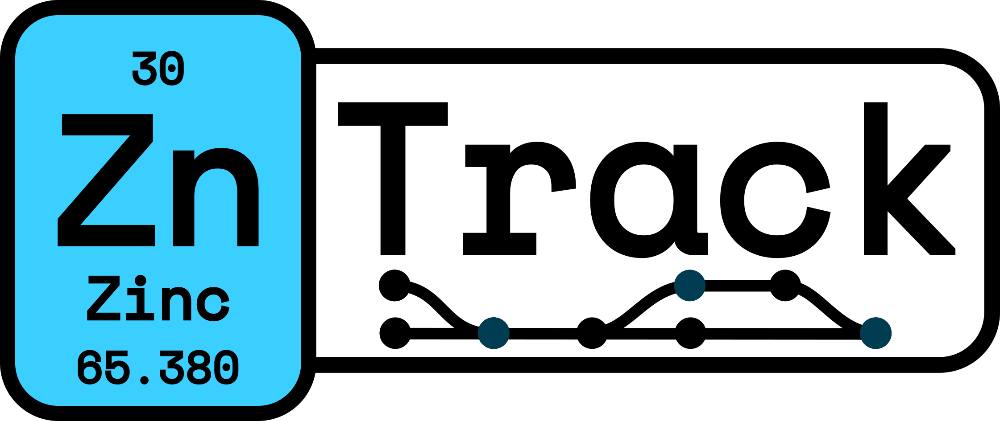

.. ZnTrack documentation master file, created by
   sphinx-quickstart on Mon Feb  6 15:28:26 2023.
   You can adapt this file completely to your liking, but it should at least
   contain the root `toctree` directive.

.. _DVC: https://dvc.org/

ZnTrack's documentation!
========================

.. raw:: html

   <iframe src="https://ghbtns.com/github-btn.html?user=zincware&repo=zntrack&type=star&count=true&size=large" frameborder="0" scrolling="0" width="130" height="30" title="GitHub"></iframe>
   <iframe src="https://ghbtns.com/github-btn.html?user=zincware&repo=zntrack&type=fork&count=true&size=large" frameborder="0" scrolling="0" width="130" height="30" title="GitHub"></iframe>

Welcome to ZnTrack, the first developer package from zincware <https://github.com/zincware>_.
We're excited to have you on board!
ZnTrack is designed to simplify code sharing and reproducibility.

.. note::

   This documentation has not been updated to the newest version of ZnTrack.
   Features and changes in :code:`v0.8.0` and newer are not included in this documentation.

- :ref:`userdoc-get-started`
- :ref:`userdoc-examples`
- :ref:`userdoc-theory`
- :ref:`userdoc-api`

Example
==========

With ZnTrack, you can construct a reproducible workflow using Nodes.
A Node, in this context, is a Python class or function with well-defined:

* **Inputs:** Parameters and dependencies.
* **Outputs:** Files, metrics, and plots.
* **Code:** Function or class run method.

Nodes are connected by passing one node instance or attribute to another, similar to regular Python objects.
Unlike executing standard Python objects, ZnTrack enables you to define the workflow first, and the code is executed in a subsequent step.

ZnTrack offers node tracking using DVC_, a Git-like version control system for data.
This feature provides automatic checkpoints, caching, and facilitates the effortless sharing of your workflow.

Here are two examples illustrating what ZnTrack Nodes can look like.
ZnTrack supports both function and class-based Nodes, as well as a combination of both.
For detailed information, check out the :ref:userdoc-get-started section.

Class based Node
----------------
.. code-block:: python

   import zntrack

   class AddNumbers(zntrack.Node):
      number1 = zntrack.params()
      number2 = zntrack.params()

      result = zntrack.outs()

      def run(self):
         self.result = self.number1 + self.number2

   with zntrack.Project() as project:
      node = AddNumbers(number1=10, number2=20)

   project.repro()

.. toctree::
   :hidden:

   _get-started/index
   _examples/index
   _theory/index
   _api/index
